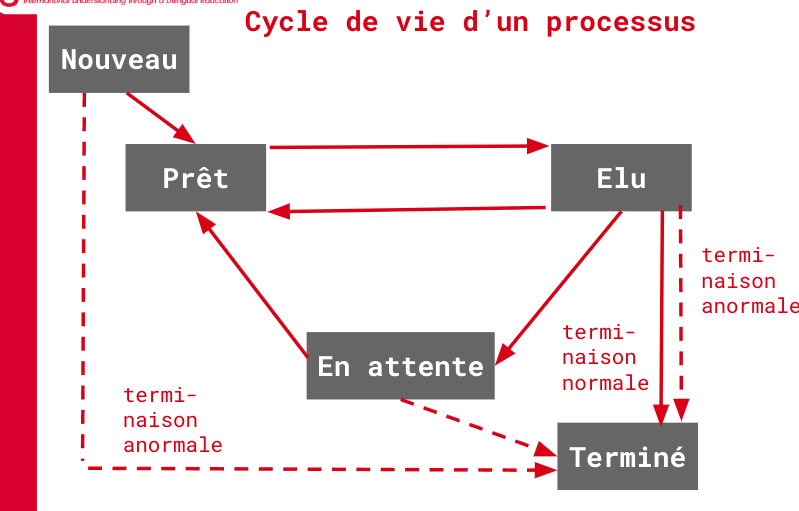

<style>

todo {
color: cyan;
background-color: red;
font-size: 20px;
}

</style>

# Rappels 1ere

## Architecture de Von Neumann


|Element|Role|
|-|-|
|**UAL** (ou ALU)|Effectuer les opérations de base|
|**Unité de contrôle** | Séquencer les instructions |
|**Mémoire**|Stocker les données et le programme qui indique à l’unité de contrôle les calculs à faire sur ces données |
| **Entrées-Sorties** |Communiquer avec les autres éléments (périphériques, carte graphique…) |


# SQL

``` SQL
DROP TABLE if exists people;
```

---

``` SQL
CREATE TABLE if not exists people(
id INTEGER PRIMARY KEY AUTOINCREMENT,
name text,
surname text,
bio_father_id int,
bio_mother_id int
);
```

---

``` SQL
CREATE TABLE track(
  trackid int, 
  trackname text, 
  artist int,
  FOREIGN KEY(artist) REFERENCES people(id)
);
```

---

``` SQL
UPDATE people SET capacite=8 WHERE crows = 8;
```

---

``` SQL
INSERT INTO people (name, surname) VALUES ('Zachary', 'MAHBOUB');
```

---

``` SQL
SELECT DISTINCT people.name, people.surname FROM tracks
JOIN people ON people.person_id = tracks.artist_id
WHERE tracks.trackname like '%wind%'
-- full name of every artist who made a song with 'wind' in name
ORDER BY tracks.trackid ASC
```

---

``` SQL
DELETE FROM track
WHERE track.trackname = 'MOOOH'
```

# Complexite

| | O() |
|-|-|
| constante | O(1) |
| logarithmique | O($log_n$) |
| lineaire | O(n) |
| log lineaire | O(n $log_n$) |
| quadratique | O($n^2$) |

# Recursivité

Les branches qu'on dessine sonts des **arbres d'appels**

**cas d'arret** : ce qui assure la **terminaison**.

# Routage

Le routage consiste à trouver les bons chemins pour acheminer chaque paquet à destination.

192.168.2.1/24 signifie que les 24 **premiers** bits **identifient le réseau** et les 8 suivants la machine dans le réseau.

S'ils sont tous des `0` --> l’adresse réseau \
S'ils sont tous des `1` --> l'adresse broadcast

- routage **statique** : à la main
- routage **dynamique** : "automatiquement", on utilise des protocoles

## Contraintes des protocoles de routage 

- **les routeurs ne connaissent pas la topologie globale du réseau**, ils ne communiquent qu’avec leurs voisins immédiats
- l’algorithme est **distribué** : _**pas de centre de gestion central**_. Chaque routeur se constitue sa propre table à partir des informations communiquées par ses voisins.
- l’algorithme est **itératif** : il est exécuté en permanence et ne s’arrête jamais. Lorsqu’une modification est faite sur le réseau, elle se propage de proche en proche à chaque routeur qui adapte sa table en conséquence.

## Protocole RIP

protocoles à vecteur de distance.

la distance exprimée en **nombre de sauts**

Ce sont donc des couples (adresse, distance), appelés vecteurs de distance, qui sont échangés avec le protocole RIP.

### Algorithme de Belman-Ford
(algorithme de recherche de plus court chemin)

- Chaque routeur reçoit en permanence (toutes les 30 secondes environ) de ses voisins les informations de routage qu'ils possèdent.
- Il exploite ces informations pour se construire lui-même sa table de routage en ne retenant que les informations les plus pertinentes : une simple comparaison permet de ne garder que le chemin le plus avantageux.
- Il transmet à son tour ces informations à ses voisins et ainsi de suite.

Le temps nécessaire à la stabilisation des tables est proportionnel au diamètre du graphe modélisant le réseau (c'est-à-dire au nombre maximal d'étapes nécessaires pour relier deux points quelconques du réseau).

#### Les Pannes

- En cas de panne d’un routeur ou de coupure d’une connexion, le réseau est informé : en effet, le routeur cesse alors d’envoyer des mises à jour à ses voisins, ou d’envoyer/recevoir des mises à jour au niveau de la connexion interrompue.
- Un routeur considère qu’un routeur voisin est en panne s’il n’a rien envoyé pendant six cycles de mise à jour consécutifs (c’est-à-dire pendant 180 secondes). Dans ce cas, il met à jour sa table en indiquant une distance 16 pour le réseau inaccessible (16 = distance infinie).


#### Contraintes

Problemes avec un diametre de 15, si le **TTL** est 15 **(time to live)**

- TTL décrémenté à chaque saut
- Distance maximale
- Taille de la table de routage limitée à 25 entrées

#### Bref

Algorithme rapide, mais rarement utilisé dans les grandes infrastrucures

## OSPF

Principe: tenir compte de la **bande passante** (bandwidth) des liaisons de communications pour calculer les meilleurs routes

Cout $\frac{10^8}{d}$ , $d$ étant le débit de la liaison

### truc

0. routeur a un ID unique

1. Des _messages hello_ sont envoyés pour établir une relation

2. Reponse

	0. si le ID est reconnu: les routeurs qui reçoivent le message, renvoient un _accusé de réception_ pour signaler qu'il est actif

	1. sinon: les informations qu’il a sur la topologie du réseau. Lorsque R reçoit ces données, il répond en faisant de même. Ces messages, contenant les états des liens de communication, sont appelés LSA (Link State Advertisement).

3. Chaque routeur d’une zone exécute un algorithme pour calculer les meilleures routes entre lui et n’importe quel autre routeur de la zone.
Le coût d’une route est la somme des coûts des liaisons entre les routeurs traversés. La meilleure route est celle qui a le coût le plus faible.

### Zones

Backbone, zone centrale

routeurs internes : in network
routeurs ABR : sur le bord du sous-réseau, connecté au back-bone

### Contraintes

-  Échanges de messages (HELLO) entre routeurs toutes les 10 secondes
environ. Si un routeur n’a pas de réponse d’un routeur de sa zone après 4 demandes consécutives, il considère le routeur inaccessible.
	- détection rapide des pannes
	- mise à jour rapide des tables de routage

- Inconvénients:
	- configuration complexe
	- capacités mémoire et CPU importantes

### Algorithme de Dijkstra

Shortest Path First (SPF)

L’algorithme de Dijsktra est un algorithme permettant de trouver le plus court chemin entre deux sommets d’un graphe pondéré, càd un graphe avec des arêtes associées à des valeurs entières.

## Compare


### Commandes

`ifconfig`

`traceroute google.com`

`nslookup`

`ping google.com`

`route` affiche table de routage de la machine

# Processus

Un **programme** est une **suite d’instructions** écrites dans un langage informatique, puis rendu exécutable par une traduction en langage machine binaire.

Un **processus** (process) est **l’instance d’exécution** d’un programme dans un certain contexte pour un ensemble particulier de données.

PID (Process Identifier)

Processus père, processus fils

- le processus 0 (Swapper) est créé. Ce processus crée un processus init : init est le fils de swapper.

- Tout processus, sauf le premier, a un identifiant **PPID** (Parent Process Id)


exécution parallèle vs exécution concurrente

<todo> possivle expansion </todo>

**ordonnanceur (scheduler)** désigne le composant du noyau du système d'exploitation qui choisit l'ordre d'exécution des processus sur les processeurs d'un ordinateur.

Algorithmes non-préemptifs (pas d'interruption) vs Algorithmes préemptifs (interruption)

<todo> Relevant commands in terminal </todo>

### Etats

- Nouveau (New, ou Created) : état d’un processus en cours de création. L’exécutable est copié en mémoire et le PCB est initialisé.
- Terminé (Terminated) : le processus s’est terminé. Le SE désalloue les ressources utilisées.

- Prêt (Ready) : Le processus est dans la file de ceux qui attendent leur tour.
- Elu (Running) : le processus utilise le processeur.
- Bloqué, ou _En Attente_ (Waiting) : le processus est interrompu en attente d’un événement externe (entrée/sortie, allocation mémoire…



### Programmation multithread

Un thread est un “sous-processus” démarré par un processus et s’exécutant de manière concurrente avec le reste du programme.


## Algos d'ordonnance

### First come first served

FIFO, ordre d'arrivée sans se soucier de la taile des processus

### Short job first

ordonnanceur laisse passer d'abord le plus court de la file

racourcir le temps d'attente moyen pour chaque processus

rentable car reduction de temps

### Shortest remaining time

comme short job first, mais on découpe

Il interrompt donc tout autre processus si un plus court est ajouté à la file.


### Round robin

Quantum, unite de temps de tour

Chaque processus est alloué un temps de l’ordre du quantum 

tourniquet

probleme avec quantum

- Si trop court
	- Changement de processus trop régulier, perte d'efficacité
- Si trop long
	- durée d'exécution (et donc d’attente) longue. (resemble à FIFO)

## Algos d'accès aux ressources

### Mutex

mutex est une couche de protection qui empêche l'accès à certaines ressources par certains processus

ces processus vont dormir

### Interblocage

oe oe, Problème : chacun attend que l'autre libère la ressource qu'il détient et, entre-temps, lui redonne la main = boucle infinie

Solution: **ordre de priorité** aux mutex

# Autres

- Puces
    - AMD vs x86
    - Loi de Moore
- Graphes
- Arbres
- File et Pile
- SQL
    - Commands
        - Insert into eleves (id, s, a) VALUES (s, s, fd)
        - Delete
        - Select
        - Join
    - Vocab
        - Atrtibut
        - jsp...
- Assert
- Test
- Router
    - Subnet mask
- Classes
- Recherche de texte
- Diviser pour regner
